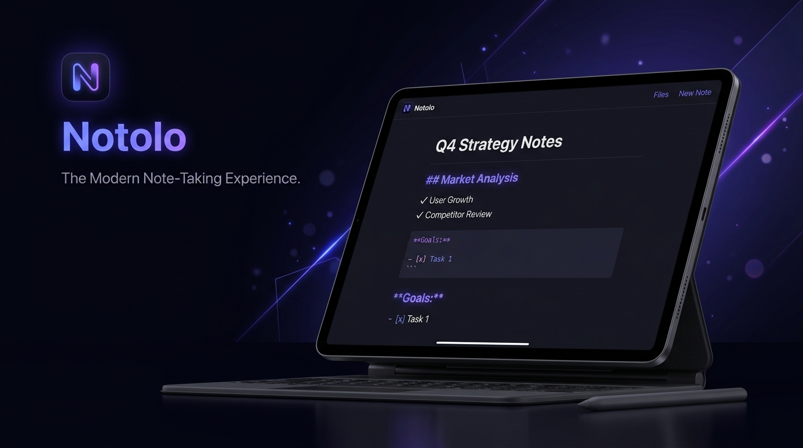

<div align="center">



# 🖋️ Notolo
### Minimalist Obsidian + Google Docs Hybrid Note-Taking App

[](https://expo.dev)
[](https://reactnative.dev)
[](https://apple.com)
[](LICENSE)

*A blisteringly fast, local-first note-taking app blending the Markdown power & privacy of **Obsidian** with the formatting elegance and document canvas of **Google Docs**.*

</div>

---

## 🌟 Why Notolo?

Most modern note apps are either **too heavy and cloud-dependent** (crashing or lagging on older hardware) or **too barebones**. 

**Notolo** is specifically engineered for **smooth 60 FPS performance on iPadOS 16 (including iPad 5th Gen with A9 & 2GB RAM)** and iOS:
- **No Account Required**: 100% private, local-first vault. Your notes never leave your device.
- **Google Docs Formatting Ribbon**: Intuitive top ribbon offering H1–H3, Bold, Italic, Strikethrough, Inline Code, Checklists, Bullet/Numbered Lists, Quotes, Tables, and Undo/Redo.
- **Smart Auto-Formatting Engine**:
  - Auto-converts `# `, `## `, `### `, `> `, `- `, `* `, `1. `, `- [ ] `.
  - Pressing `Enter` on any list or checklist item auto-continues it on the next line.
  - Pressing `Enter` on an empty list bullet clears it and exits list mode (just like Google Docs).
- **Interactive Checklist in Preview**: Tap checkboxes in Reader mode to check items off in real-time with tactile haptic feedback.
- **iPad Multi-Column Split View**:
  - Collapsible Sidebar with instant note search, folder filters, and pinned notes.
  - Split View: Side-by-side Markdown editor and live rendered document sheet.
  - Reader View: Distraction-free reading experience.
- **Export Anywhere**: Export instantly as Markdown (`.md`), Plain Text (`.txt`), or generate clean PDFs using Apple Print dialog.

---

## 🎨 Design Philosophy & Aesthetics

- **Obsidian Dark & Daylight Light Modes**: Automatic system color scheme detection or manual one-tap switch.
- **Document Sheet Canvas**: Centered sheet with generous typography margins avoiding line-wrap fatigue on widescreen iPads.
- **Haptic Feedback**: Subtle, satisfying tactile clicks when toggling tasks, pinning notes, or activating formatting tools.

---

## ⌨️ Auto-Formatting Shortcuts

| Shortcut / Trigger | Action |
| :--- | :--- |
| `# ` | Converts line to Heading 1 |
| `## ` | Converts line to Heading 2 |
| `### ` | Converts line to Heading 3 |
| `- ` or `* ` | Starts bulleted list |
| `1. ` | Starts numbered list |
| `- [ ] ` | Starts interactive task checklist |
| `> ` | Creates a blockquote |
| `Enter` on active list item | Auto-continues next list item |
| `Enter` on empty list bullet | Clears bullet and returns to normal text |

---

## 🚀 Getting Started

### Prerequisites
- Node.js (v18+)
- Expo CLI (`npx expo`)
- Expo Go on your iPad (iPadOS 16.0+) or iPhone / Android device

### Installation
```bash
# Clone repository
git clone https://github.com/HaroonAzizi/Notolo.git
cd Notolo

# Install dependencies
npm install

# Start the Expo development server
npx expo start
```

### Running on iPadOS / iOS
1. Open the **Camera** or **Expo Go** app on your iPad.
2. Scan the QR code in your terminal.
3. Enjoy an ultra-responsive, beautiful writing experience!

---

## 🏗️ Architecture

```
src/
├── types/                # TypeScript interfaces (Note, Folder, ViewMode)
├── theme/                # Obsidian Dark & Daylight Light palettes & ThemeContext
├── utils/
│   ├── autoFormatter.ts  # Smart enter, prefix interceptor, selection wrapper
│   ├── markdownParser.ts # Fast native block & inline markdown tokenizer
│   ├── storage.ts        # Local-first AsyncStorage & FileSystem vault
│   ├── vaultStore.ts     # Lightweight Zustand state store
│   ├── haptics.ts        # Multi-level tactile haptic engine
│   └── exportHelper.ts   # .md, .txt, and PDF export pipeline
└── components/
    ├── layout/           # AppHeader, Sidebar, NoteListItem
    ├── editor/           # GoogleDocsToolbar, SmartEditor
    ├── preview/          # MarkdownViewer (interactive checklist)
    └── modals/           # ExportModal
```

---

## 📄 License
MIT © Haroon Azizi
